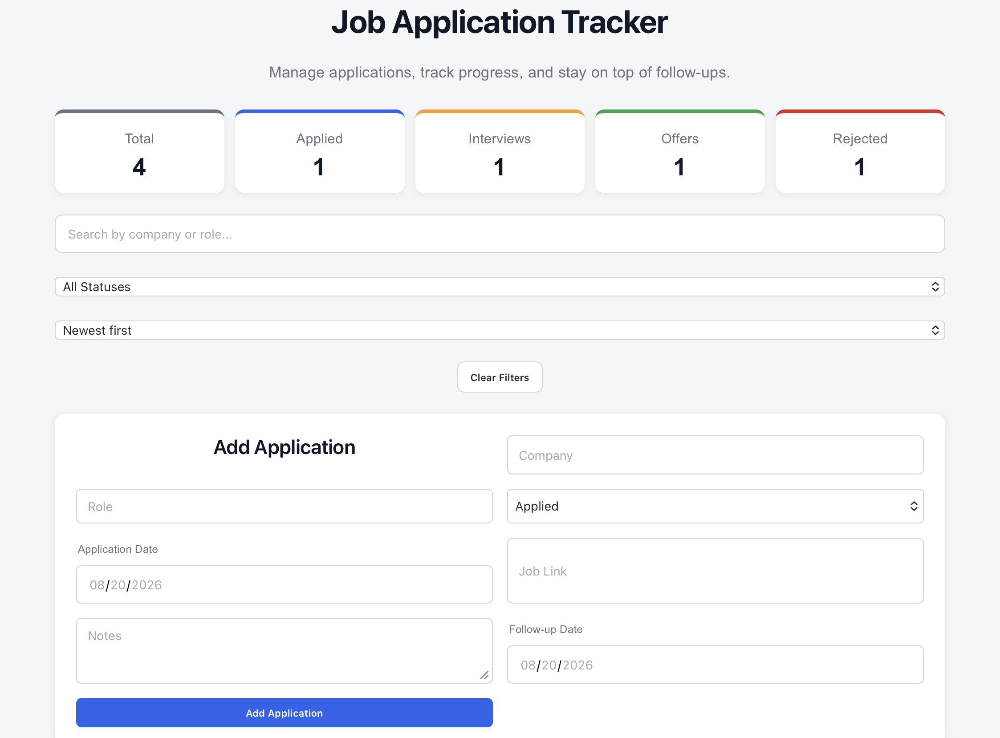
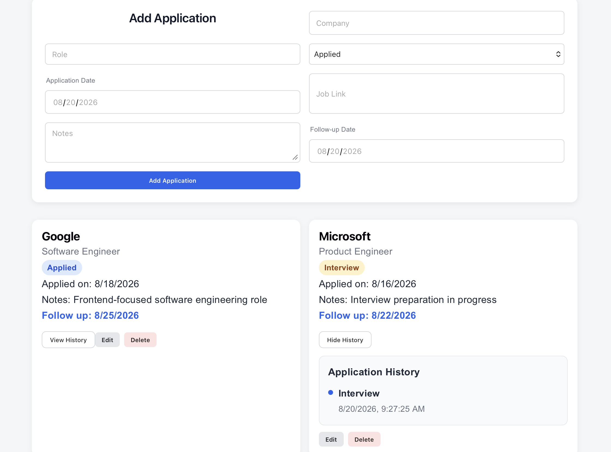

# Job Application Tracker

A production-deployed full-stack web application for managing job applications, tracking hiring progress, follow-up dates, and application status history through an interactive dashboard.

The project demonstrates end-to-end full-stack development using React, TypeScript, Node.js, Express, PostgreSQL, REST APIs, automated testing, database transactions, validation, and production deployment.

## Live Demo

**Frontend:**  
https://job-tracker-frontend-heqb.onrender.com

**Backend API:**  
https://job-tracker-2pm2.onrender.com

> The backend is hosted on Render's free tier and may take several seconds to wake after inactivity.

## Screenshots

### Dashboard



### Application History



## Features

- Add, edit, and delete job applications
- Track application status: Applied, Interview, Offer, and Rejected
- View application statistics through an interactive dashboard
- Click dashboard statistics to filter applications by status
- Search applications by company or role
- Filter applications by status
- Sort applications by application date
- Store job posting links and notes
- Track application and follow-up dates
- Highlight overdue and due-today follow-ups
- Clear active search, filter, and sorting selections
- Validate required form fields
- Display loading and error states
- Persist application data using PostgreSQL
- Track application status history
- Record initial application status automatically
- Record subsequent status transitions
- Support forward and backward status transitions
- Delete related history using database cascade rules
- Responsive user interface
- Production frontend, backend, and database deployment

---

## Tech Stack

### Frontend

- React
- TypeScript
- Vite
- CSS
- Fetch API

### Backend

- Node.js
- Express.js
- REST API
- CORS

### Database

- PostgreSQL

### Testing

- Jest
- Supertest

### Deployment

- Render Static Site
- Render Web Service
- Render PostgreSQL

### Development Tools

- Git
- GitHub
- VS Code
- npm
- psql

---

## Architecture

The application follows a full-stack client-server architecture:

```text
React + TypeScript Frontend
            |
            | HTTP / REST
            v
      Express REST API
            |
            | SQL
            v
        PostgreSQL
```

In production:

```text
Render Static Site
        |
        v
Render Node Web Service
        |
        v
Render PostgreSQL
```

The React frontend manages the user interface, form state, filtering, sorting, and interactions.

The Express backend exposes REST API endpoints and handles validation, application operations, status history, and database communication.

PostgreSQL provides persistent relational data storage.

The frontend communicates with the backend through an environment-configured API base URL, while the backend connects to PostgreSQL using environment variables.

---

## Frontend Structure

The frontend is organized into reusable components, services, and shared TypeScript types.

```text
client/src/
├── components/
│   ├── ApplicationCard.tsx
│   ├── ApplicationForm.tsx
│   ├── FilterBar.tsx
│   └── StatsDashboard.tsx
├── services/
│   └── applicationService.ts
├── types/
│   ├── application.ts
│   └── applicationHistory.ts
├── App.tsx
├── App.css
└── main.tsx
```

The service layer centralizes API communication so frontend components do not depend on hard-coded backend URLs.

---

## REST API

The Express backend exposes REST endpoints for application management and status history.

### Applications

```text
GET    /applications
POST   /applications
PUT    /applications/:id
DELETE /applications/:id
```

### Application History

```text
GET /applications/:id/history
```

The API validates requests before performing database operations.

Validation includes:

- Required company field
- Required role field
- Allowed application statuses
- Valid application IDs
- Existing application checks
- Follow-up date consistency

Appropriate HTTP status codes and JSON error responses are returned when validation fails.

---

## PostgreSQL Data Model

The application uses two related tables.

### applications

Stores the current state of each job application.

Core fields include:

```text
id
company
role
status
application_date
job_link
notes
follow_up_date
```

### application_history

Stores application status transitions.

Core fields include:

```text
id
application_id
status
changed_at
```

`application_id` references the parent application.

The relationship uses:

```sql
ON DELETE CASCADE
```

This ensures that history records are automatically deleted when their associated application is removed.

---

## Status History

Every newly created application receives an initial history entry.

For example:

```text
Applied
```

When the application's status changes:

```text
Applied
   ↓
Interview
   ↓
Offer
```

each transition is stored separately with a timestamp.

Backward transitions are also supported:

```text
Interview
   ↓
Applied
```

This preserves the actual lifecycle of an application rather than assuming that status can only move forward.

---

## Database Transactions

Some operations require multiple related database writes.

Creating an application requires:

```text
INSERT application
INSERT initial history
```

Changing an application's status can require:

```text
UPDATE application
INSERT status history
```

These related operations use PostgreSQL transactions:

```text
BEGIN
   ↓
Database operations
   ↓
COMMIT
```

If an operation fails:

```text
ROLLBACK
```

This helps prevent inconsistent database states when a multi-step operation does not complete successfully.

---

## Backend Validation and Error Handling

Validation is performed by the backend independently of the frontend.

Examples include:

- Missing company or role
- Invalid status
- Invalid application ID
- Application not found
- Follow-up date earlier than application date

This protects the database even when requests are sent directly to the API instead of through the React interface.

---

## Automated API Testing

Backend tests are implemented using Jest and Supertest.

The test suite covers important API behavior including:

- Missing required fields
- Invalid application status
- Invalid follow-up dates
- Successful application creation
- Automatic initial history creation
- Successful application updates
- Status-change history creation
- Avoiding duplicate history when status is unchanged
- Backward status transitions
- Application deletion
- Cascading history deletion
- History endpoint responses
- Invalid application IDs
- Missing applications

Automated tests were run successfully during development before production deployment.

---

## Environment Configuration

The application uses environment variables so development and production environments can use different configuration without hard-coded credentials or URLs.

### Client

Example:

```env
VITE_API_BASE_URL=http://localhost:3001
```

Production uses the deployed backend API URL.

### Server

The backend configuration uses environment variables such as:

```env
DATABASE_URL=
DB_USER=
DB_HOST=
DB_NAME=
DB_PASSWORD=
DB_PORT=
DB_TEST_NAME=
FRONTEND_URL=
```

Actual `.env` files are excluded from Git.

Example configuration files can be provided through:

```text
client/.env.example
server/.env.example
```

---

## Production Deployment

The complete application is deployed on Render.

### Frontend

The React/Vite application is deployed as a Render Static Site.

### Backend

The Express API is deployed as a Render Node.js Web Service.

### Database

Application data is persisted in a production PostgreSQL database.

Production configuration includes:

- Environment-based frontend API URL
- Environment-based database connection
- Production CORS configuration
- Render-provided server port
- PostgreSQL production schema
- Automatic deployment from GitHub

---

## Production Verification

The deployed application was tested end-to-end after deployment.

Verified workflows include:

```text
CREATE
READ
UPDATE
DELETE
STATUS HISTORY
DATABASE PERSISTENCE
CORS
FRONTEND → BACKEND
BACKEND → POSTGRESQL
```

This confirms that the frontend, backend API, and production database operate together as a complete deployed system.

---

## Running Locally

### Prerequisites

Install:

- Node.js
- npm
- PostgreSQL

### 1. Clone the repository

```bash
git clone https://github.com/komalramani/job-tracker.git
cd job-tracker
```

### 2. Install frontend dependencies

```bash
cd client
npm install
```

### 3. Install backend dependencies

```bash
cd ../server
npm install
```

### 4. Configure Environment Variables

Create local environment files for the frontend and backend:

```text
client/.env
server/.env
```

Use the corresponding `.env.example` files as templates.

### 5. Configure PostgreSQL

Create the PostgreSQL database and required tables:

```text
applications
application_history
```

Configure the backend database environment variables accordingly.

### 6. Start the Backend

From the `server` directory:

```bash
node index.js
```

The local API runs on:

```text
http://localhost:3001
```

### 7. Start the Frontend

Open another terminal and run:

```bash
cd client
npm run dev
```

Open the local URL displayed by Vite in your browser.

---

## Running Tests

From the `server` directory:

```bash
npm test
```

The test environment uses a separate PostgreSQL test database so automated test data does not interfere with development data.

---

## Engineering Decisions

Several design decisions were made to improve reliability and maintainability:

- Reusable React components instead of one large UI component
- Shared TypeScript types
- Centralized frontend API service layer
- Server-side validation in addition to frontend validation
- PostgreSQL transactions for related database writes
- Dedicated application history table instead of overwriting status history
- Cascading deletes for relational integrity
- Separate development and test databases
- Environment-based configuration instead of hard-coded production URLs
- Automated API testing before deployment

---

## Key Learning Outcomes

Building this project provided practical experience with:

- Full-stack application architecture
- React state management
- Reusable component design
- TypeScript typing
- Controlled forms
- REST API design
- Asynchronous API communication
- Express routing
- PostgreSQL integration
- Relational database design
- Database constraints
- Database transactions
- CRUD operations
- HTTP status codes and validation
- Automated API testing
- Search, filtering, and sorting
- Derived dashboard statistics
- Date-based follow-up logic
- Loading and error states
- Responsive UI development
- CORS configuration
- Environment variables
- Production debugging
- Git and GitHub workflow
- Full-stack production deployment

---

## Project Status

**Completed and deployed.**

The application is live, connected to a production PostgreSQL database, and the core full-stack workflows have been verified end-to-end.